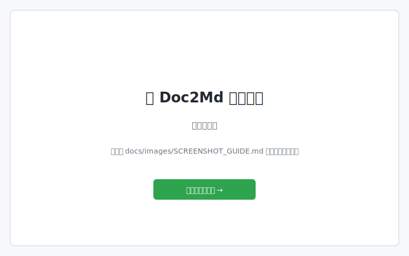

# Doc2Md

[](https://github.com/karazel17/Doc2Md/actions/workflows/python-test.yml)
[](https://www.python.org/)
[](https://opensource.org/licenses/MIT)

一个简单易用的文档批量转换工具，支持将 PDF、Word、PPT、EPUB、HTML 等多种格式转换为 Markdown 格式。

---

## 📸 界面预览

### 主界面



### 转换过程


> 💡 **截图待添加** - 欢迎提交 PR 补充真实界面截图！
> 
> 查看 [截图指南](docs/images/SCREENSHOT_GUIDE.md) 了解如何添加截图。

## ✨ 特性

- 🖥️ **Web 界面** - 基于 Gradio 的直观操作界面
- 📁 **批量处理** - 支持整目录递归转换，保持原始目录结构
- 📄 **多格式支持** - PDF、Word (.docx/.doc)、PPT、EPUB、HTML、TXT
- 🔍 **OCR 识别** - 自动识别扫描件 PDF 内容
- 🖼️ **图片提取** - 自动提取并保存文档中的图片
- ⚡ **高性能** - 支持多线程并行处理

## 🚀 快速开始

### 前置要求

- **Python 3.9 - 3.12**（必需）
- **LibreOffice**（可选，用于 .doc 文件支持）

### macOS / Linux

```bash
git clone https://github.com/karazel17/Doc2Md.git
cd Doc2Md
chmod +x install.sh && ./install.sh
./start.sh
```

### Windows

```cmd
git clone https://github.com/karazel17/Doc2Md.git
cd Doc2Md
install.bat
start.bat
```

启动后会自动在浏览器中打开 `http://localhost:7860`

---

## 📦 环境配置详解

### 1. Python 环境

**支持的版本**：Python 3.9、3.10、3.11、3.12

**安装方法**：

| 系统 | 命令 |
|------|------|
| macOS (Homebrew) | `brew install python@3.11` |
| Ubuntu/Debian | `sudo apt install python3.11 python3.11-venv` |
| Windows | [官网下载](https://www.python.org/downloads/) |

### 2. 可选依赖

#### LibreOffice（用于 .doc 文件支持）

旧版 Word 文档（`.doc`）需要 LibreOffice 进行转换。

| 系统 | 安装命令 |
|------|----------|
| macOS | `brew install --cask libreoffice` |
| Ubuntu/Debian | `sudo apt install libreoffice` |
| Windows | [官网下载](https://www.libreoffice.org/download/) |

**注意**：`.docx` 格式不需要 LibreOffice，可直接转换。

#### MinerU（高质量 PDF 转换）

如果安装时未选择 MinerU，可手动安装：

```bash
cd Doc2Md
source venv/bin/activate  # macOS/Linux
# 或 venv\Scripts\activate  # Windows

pip install "magic-pdf[full]"
```

---

## 📖 使用指南

### 基本使用流程

1. **启动程序**
   - macOS/Linux: 双击 `start.sh` 或在终端运行 `./start.sh`
   - Windows: 双击 `start.bat`

2. **选择输入目录**
   - 在 Web 界面中输入待转换文件夹的路径
   - 支持直接从文件管理器拖拽文件夹到输入框

3. **选择文件类型**
   - 勾选需要转换的文件类型
   - 支持多选：PDF、DOCX、DOC、PPTX、EPUB、HTML、TXT

4. **预览文件**
   - 点击"预览文件"查看即将转换的文件列表
   - 确认文件数量和路径

5. **开始转换**
   - 点击"开始转换"按钮
   - 等待转换完成，输出文件保存在 `output/` 目录

### 高级选项

| 选项 | 说明 |
|------|------|
| 使用 MinerU | 使用 MinerU 引擎处理 PDF（质量更高，速度较慢） |
| 递归子目录 | 同时转换子目录中的文件 |
| OCR 识别 | 对扫描件 PDF 进行文字识别 |

### 输出结构

```
output/
└── [原目录名]/
    ├── [文件名].md          # 转换后的 Markdown 文件
    └── [文件名]_images/     # 提取的图片文件夹
```

---

## 📋 支持的文件格式

| 格式 | 扩展名 | 说明 | 依赖库 |
|------|--------|------|--------|
| PDF | .pdf | 支持文本型和扫描件 PDF | PyMuPDF / MinerU |
| Word | .docx | 直接支持 | python-docx, mammoth |
| Word | .doc | 需 LibreOffice | LibreOffice |
| PowerPoint | .pptx | 直接支持 | python-pptx |
| EPUB | .epub | 电子书格式 | EbookLib |
| HTML | .html, .htm | 网页文件 | BeautifulSoup4, markdownify |
| 文本 | .txt | 纯文本文件 | chardet（自动编码检测） |

---

## 🛠️ 技术栈与致谢

本项目基于以下优秀的开源项目构建，衷心感谢所有开源贡献者：

### 核心依赖

| 项目 | 用途 | 许可证 |
|------|------|--------|
| **[Gradio](https://github.com/gradio-app/gradio)** | Web 界面框架 | Apache-2.0 |
| **[PyMuPDF](https://github.com/pymupdf/PyMuPDF)** | PDF 处理与渲染 | AGPL-3.0 |
| **[PyMuPDF4LLM](https://github.com/pymupdf/PyMuPDF4LLM)** | PDF 转 Markdown | AGPL-3.0 |
| **[MinerU](https://github.com/opendatalab/MinerU)** | 高质量 PDF 解析与转换 | AGPL-3.0 |

### 文档处理库

| 项目 | 用途 | 许可证 |
|------|------|--------|
| **[python-docx](https://github.com/python-openxml/python-docx)** | Word (.docx) 处理 | MIT |
| **[mammoth](https://github.com/mwilliamson/mammoth.js)** | Word 文档转换 | BSD-2-Clause |
| **[python-pptx](https://github.com/scanny/python-pptx)** | PowerPoint 处理 | MIT |
| **[EbookLib](https://github.com/aerkalov/ebooklib)** | EPUB 电子书处理 | AGPL-3.0 |
| **[BeautifulSoup4](https://www.crummy.com/software/BeautifulSoup/)** | HTML 解析 | MIT |
| **[markdownify](https://github.com/matthewwithanm/python-markdownify)** | HTML 转 Markdown | MIT |

### OCR 与文本处理

| 项目 | 用途 | 许可证 |
|------|------|--------|
| **[RapidOCR](https://github.com/RapidAI/RapidOCR)** | OCR 文字识别 | Apache-2.0 |
| **[chardet](https://github.com/chardet/chardet)** | 文本编码检测 | LGPL-2.1 |

### 开发工具与部署

| 项目/工具 | 用途 |
|-----------|------|
| **[Claude Code](https://claude.ai/code)** | AI 辅助编程工具 |
| **[uv](https://github.com/astral-sh/uv)** | 极速 Python 包管理器 |

---

## 📄 许可证

本项目采用 **MIT 许可证** 开源发布。

```
MIT License

Copyright (c) 2024 karazel17

Permission is hereby granted, free of charge, to any person obtaining a copy
of this software and associated documentation files (the "Software"), to deal
in the Software without restriction, including without limitation the rights
to use, copy, modify, merge, publish, distribute, sublicense, and/or sell
copies of the Software, and to permit persons to whom the Software is
furnished to do so, subject to the following conditions:

The above copyright notice and this permission notice shall be included in all
copies or substantial portions of the Software.

THE SOFTWARE IS PROVIDED "AS IS", WITHOUT WARRANTY OF ANY KIND, EXPRESS OR
IMPLIED, INCLUDING BUT NOT LIMITED TO THE WARRANTIES OF MERCHANTABILITY,
FITNESS FOR A PARTICULAR PURPOSE AND NONINFRINGEMENT. IN NO EVENT SHALL THE
AUTHORS OR COPYRIGHT HOLDERS BE LIABLE FOR ANY CLAIM, DAMAGES OR OTHER
LIABILITY, WHETHER IN AN ACTION OF CONTRACT, TORT OR OTHERWISE, ARISING FROM,
OUT OF OR IN CONNECTION WITH THE SOFTWARE OR THE USE OR OTHER DEALINGS IN THE
SOFTWARE.
```

**注意**：本项目使用的部分依赖库（如 PyMuPDF、MinerU、EbookLib）采用 AGPL-3.0 许可证，请在使用和分发时遵守相关许可证要求。

---

## 🤝 贡献

欢迎提交 Issue 和 Pull Request！

## 📧 联系

如有问题或建议，欢迎通过 GitHub Issues 联系。

---

> Made with ❤️ using [Claude Code](https://claude.ai/code)
